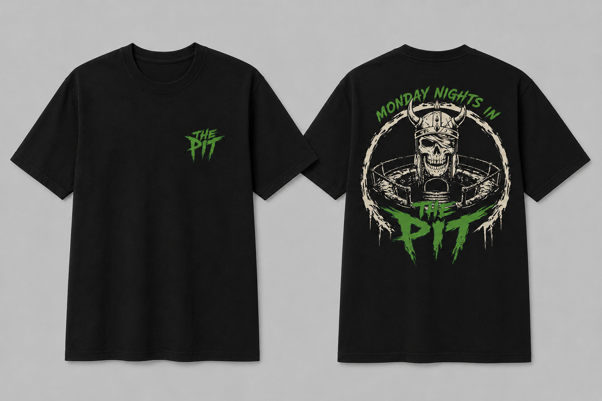

When Caledonian Clash initially started back in 2023, we were in the position to donate a percentage of our weekly earnings to a charity called Mikeysline. For those that aren't familiar, Mikeysline is a nonprofit based in Inverness that helps with Mental Health, with a primary aim being young men.
As the club grew and we started running bigger events etc, the money we were donating ended up having to be used for the running of the club. 

Over the past few weeks I have been working on a bit of a side project with the intention of trying to bring some kind of charity work back to the club while also bringing value to the people that have helped grow Caledonian Clash into what it is today. 

The Pit. 

If you've spent any time in this discord, or attended any of our Weeklies, you'll know what The Pit is. It's more than just the place where we play fighting games, it's become a home for CC, where laughter, salt and I'm fairly certain tears have been shed. I wanted to create something that represented that. 

I will be placing an order for a limited run of "The Pit" shirts, each shirt will cost £25 with any profit being made from the sales going directly to Mikeysline. 

For those who are interested, please send the money directly to the group Monzo with the of "The Pit" and then please DM me your size on discord. 

Order will likely be getting placed toward the end of June.

All artwork was commissioned.

https://monzo.me/stevencampbell97/25.00?d=The%20Pit%20Merch&h=Pw17wb

 

For those that want to read more about Mikeysline:

https://mikeysline.co.uk/

- Pyros
